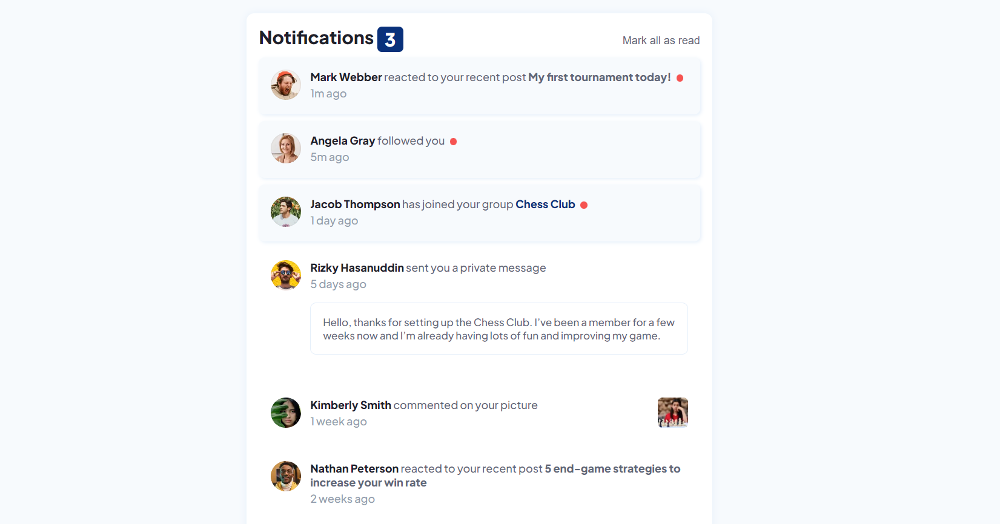

# Frontend Mentor - Notifications page solution

This is a solution to the [Notifications page challenge on Frontend Mentor](https://www.frontendmentor.io/challenges/notifications-page-DqK5QAmKbC). Frontend Mentor challenges help you improve your coding skills by building realistic projects.

## Table of contents

- [Overview](#overview)
  - [The challenge](#the-challenge)
  - [Screenshot](#screenshot)
  - [Links](#links)
- [My process](#my-process)
  - [Built with](#built-with)
  - [What I learned](#what-i-learned)
- [Author](#author)

## Overview

### The challenge

Users should be able to:

- Distinguish between "unread" and "read" notifications
- Select "Mark all as read" to toggle the visual state of the unread notifications and set the number of unread messages to zero
- View the optimal layout for the interface depending on their device's screen size
- See hover and focus states for all interactive elements on the page

### Screenshot



### Links

- Solution URL: [FrontendMentor](https://www.frontendmentor.io/profile/mirfanwebdev)
- Live Site URL: [Github Pages](https://mirfanwebdev.github.io/frontendmentor-notification/)

## My process

### Built with

- Semantic HTML5 markup
- CSS custom properties
- Flexbox
- Mobile-first workflow
- Javascript

### What I learned

I learned DOM manipulation for strengthen my fundamental with vanilla Javascript. Displaying each nortification using loop:

```js
notification.map((item) => {
  const div = document.createElement("div");
  const contentDiv = document.createElement("div");
  const imageContainer = document.createElement("div");

  imageContainer.innerHTML = ``;
  contentDiv.innerHTML = `<span class="bold">${item.name}</span> ${
    item.message
  } ${item.link ? `<a href="#">${item.link}</a>` : ""}${
    item.highlight
      ? `<span class="notification-item--highlight">${item.highlight}</span>`
      : ""
  } ${
    item.status == "unread" ? `<span class="unread-badge">&nbsp;</span>` : ""
  } <p class="notification-item--time">${item.time} ago</p>`;

  notification.appendChild(div);
  div.appendChild(imageContainer);
  div.appendChild(contentDiv);
});
```

I also added individual read function to each of unread notification using DOM manipulation to remove special CSS styling for unread class. Unreaded notification badge also updated:

```js
function readNotification(item) {
  item.classList.remove("unread");
  getCounter(counter - 1);
  return (counter -= 1);
}
```

## Author

- Website - [M. Irfan](https://mirfandev.tech)
- Frontend Mentor - [@mirfanwebdev](https://www.frontendmentor.io/profile/mirfanwebdev)
- Twitter - [@mirfanwebdev](https://https://twitter.com/mirfanwebdev)
